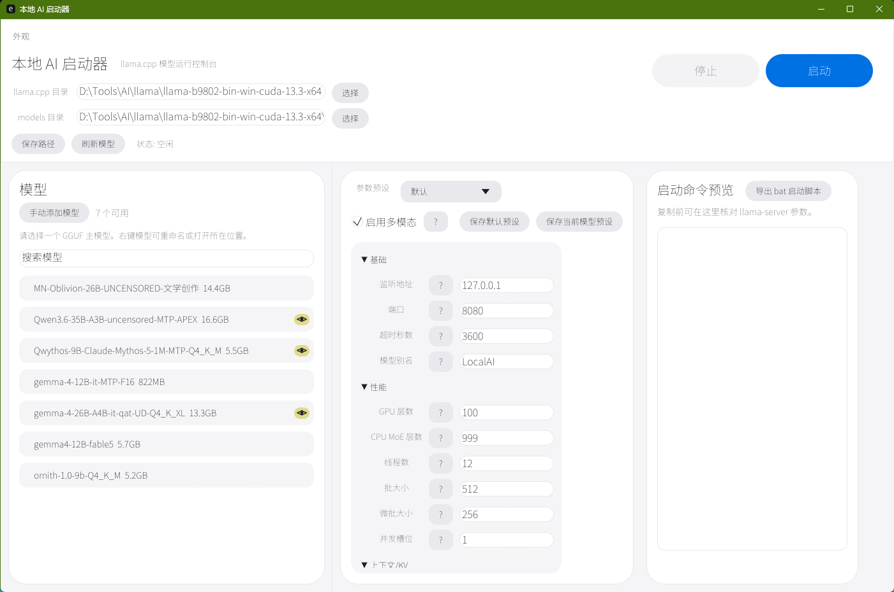

# 本地 AI 启动器



Rust/egui 编写的 llama.cpp 本地模型 GUI 启动器。

## 功能

- 配置 `llama.cpp` 目录和模型目录。
- 自动扫描 GGUF 主模型，并识别多模态 `mmproj` 和 draft/MTP 模型。
- 支持将任意 GGUF 标记为 `--spec-draft-model` 草稿模型，标记后不再作为主模型显示；手动添加回来时可恢复为主模型。
- 支持为当前主模型添加/修改跨文件夹 draft 草稿模型，用于 MTP、dflash 等推测解码草稿模型。
- 支持默认参数预设和模型专属参数预设。
- 支持右键重命名模型显示名、打开模型所在位置、隐藏模型。
- 支持拖动调整模型显示顺序。
- 支持启动/停止 `llama-server.exe`，运行日志在独立窗口显示。
- 支持导出当前启动命令为 `.bat` 脚本。
- 支持额外参数逐行填写，预览/脚本会按命令行参数拆分并正确引用模型路径。
- 启动命令预览和导出脚本优先使用完整参数名，例如 `--model`、`--spec-draft-model`、`--ctx-size`。
- 支持基础外观设置。
- 支持 Windows exe 文件图标和运行窗口图标。

## 构建

```powershell
cargo build --release
```

生成文件：

```text
target\release\local_ai_launcher.exe
```

如需尽量减少外部运行库依赖：

```powershell
$env:RUSTFLAGS='-C target-feature=+crt-static'
cargo build --release
```

## 配置

程序会在 exe 同目录生成 `local-ai-launcher-config.json`。该文件保存本机路径、模型显示设置、预设、draft 草稿模型选择和外观配置，不建议提交到仓库。

## 发布

推送 `v*` 标签会触发 GitHub Actions 自动构建 Windows 单文件 exe，并发布到 GitHub Release：

```powershell
git tag v0.1.2
git push origin v0.1.2
```

也可以在 GitHub Actions 页面手动运行 `Release` 工作流生成构建产物。

## 协议

MIT
