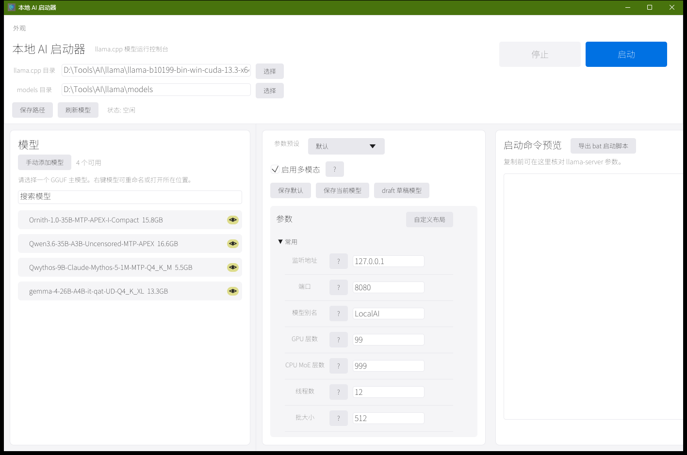

# 本地 AI 启动器



Rust/egui 编写的 llama.cpp 本地模型 GUI 启动器。

## 功能

- 配置 `llama.cpp` 目录和模型目录。
- 自动扫描 GGUF 主模型，并识别多模态 `mmproj` 和 draft/MTP 模型。
- 支持将任意 GGUF 标记为 `--spec-draft-model` 草稿模型，标记后不再作为主模型显示；手动添加回来时可恢复为主模型。
- 支持为当前主模型添加/修改跨文件夹 draft 草稿模型，用于 MTP、dflash 等推测解码草稿模型。
- 自动识别到 MTP draft 模型且推测类型保持“默认”时，仅自动添加 `--spec-type draft-mtp`；草稿 N 和概率参数保留 llama.cpp 默认值。
- 支持默认参数预设和模型专属参数预设。
- 参数面板分为“常用”“其他参数”“额外参数”三部分；内置参数可通过拖动句柄在常用/其他之间排序，自由文本参数可跨分区移动，默认和当前模型预设分别保存各自的参数位置。
- 使用当前 `llama-server` 参数：`--load-mode`、`--flash-attn`、`--reasoning-preserve` 和固定推测类型选项；旧 `--mmap`、`--no-mmap`、`--mlock` 不再由启动器生成。
- 支持右键重命名模型显示名、打开模型所在位置、隐藏模型。
- 支持拖动调整模型显示顺序。
- 支持启动/停止 `llama-server.exe`，运行日志在独立窗口显示。
- 支持导出当前启动命令为 `.bat` 脚本。
- 支持额外参数逐条填写、启用/禁用、删除和拖动，预览/脚本会按命令行参数拆分并正确引用模型路径。
- 启动命令预览和导出脚本优先使用完整参数名，例如 `--model`、`--spec-draft-model`、`--ctx-size`。
- 新预设默认启用 `--jinja`；Web UI、日志时间戳和其他开关默认不传，可在参数控件中显式启用或禁用。
- 支持基础外观设置。
- 支持 Windows exe 文件图标和运行窗口图标。

## 构建

```powershell
cargo build --release
```

生成文件：

```text
target\release\local_ai_launcher.exe
```

生成发布用的静态 CRT 单文件并复制到 `dist`：

```powershell
$env:RUSTFLAGS='-C target-feature=+crt-static'
cargo build --release --locked
New-Item -ItemType Directory -Force -Path dist | Out-Null
Copy-Item target\release\local_ai_launcher.exe dist\本地AI启动器.exe -Force
```

最终发布文件为 `dist\本地AI启动器.exe`；`target\` 仅包含 Cargo 构建缓存和中间产物，
不参与发布或 Git 推送。

## 配置

程序会在 exe 同目录生成 `local-ai-launcher-config.json`。该文件保存本机路径、模型显示设置、预设、draft 草稿模型选择和外观配置，不建议提交到仓库。

## 发布

推送 `v*` 标签会触发 GitHub Actions 自动构建 Windows 单文件 exe，并发布到 GitHub Release。Release 下载资产名为 `local-ai-launcher.exe`：

```powershell
git tag v0.1.6
git push origin v0.1.6
```

也可以在 GitHub Actions 页面手动运行 `Release` 工作流生成构建产物。

## 协议

MIT
